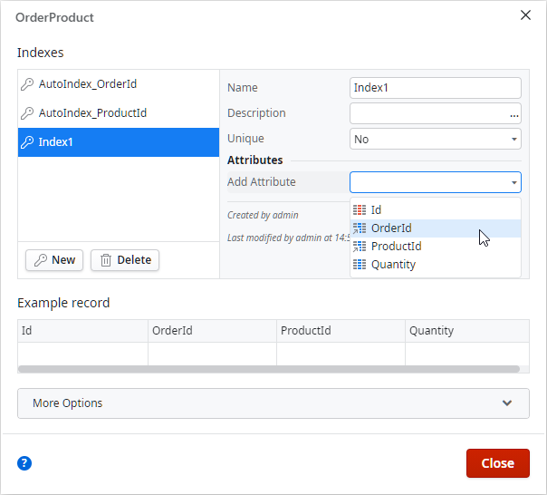

# Create an Entity Index
  
You can define a database index in your data model to enforce uniqueness of table attributes across multiple rows or to make searches quicker using those attributes as filters. In OutSystems, you can model a database index in the entity element.

See [Database Indexes](<../../../ref/data/database/database-indexes.md>) for more information about creating database indexes.

To create an index for an entity:

1. Right-click the Entity, or click the **Indexes and more** button in the Entity properties.

    

1. Click the **New** button to create an index, then set its name on the right pane.

1. If you want this index to restrict records to be unique, change the **Unique** property to **Yes**.

    

1. Add the attributes you want to include in the index.

    

1. To apply the index created in the database, publish the module.

    During the publishing process, OutSystems will create the corresponding database index as defined in the Entity properties.
