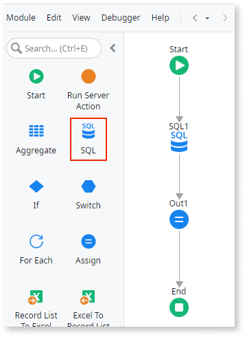
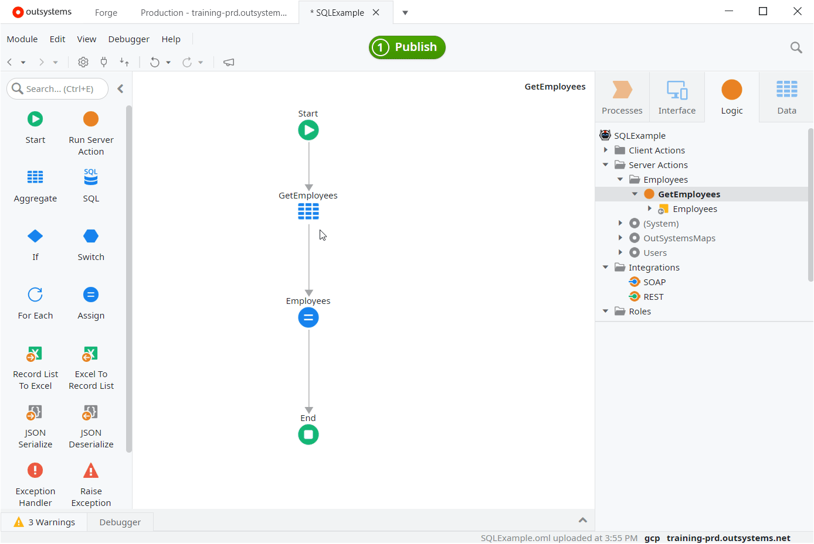

# SQL Queries

The **SQL** element lets you run, test, and review SQL queries in your apps. SQL is an all-purpose tool for developers who know SQL language. For a more straightforward and optimized data manipulation use **Aggregates**.

## Accessing data

**SQL** accesses data through the input parameters only, and other logic can access only what the SQL query returns through its Outputs.

Input parameters
:   Providing input parameters lets you use dynamic data in the SQL query. Input parameters are optional. To reference an input parameter in your SQL statement use a `@` prefix, e.g. `@CustomInputParameter`.

Output parameters
:   **SQL** in OutSystems queries always have two output parameters, even when the query executed doesn't return a result:

    * **List**: The list with the result returned by the query. The list is empty if there are no results.
    
    * **Count**: The number of records returned by the query without considering the SQL Max Records property.

Output Structure
:   Output Structure is mandatory. You need to define the structure (data types of the columns) that your query returns. You can use any combination of Entities, Structures or both, but the attribute order/data type must match your Select. Output Structure is needed even if your SQL statement doesn't return any results.

    * Example 1: When selecting all attributes of the Employee Entity (with `Id`, `Name`, `Email`, and `PhoneNumber` attributes), 
    specify the Employee Entity as the Output Structure. This enforces that List output parameter of the SQL 
    query returns Employee List data type.
    
    * Example 2: When selecting only the `Name` and `Email` of the same Employee Entity, create a Structure 
    (named EmployeeInfo) to hold the attributes you need and use it as the Output Structure. The data type and order of the attributes in the SELECT statement must match the data type and order of the attributes of the EmployeeInfo Structure. This 
    enforces that List output parameter of the SQL query returns EmployeeInfo List data type. 

To reference an entity in your SQL query write it between curly brackets (for example, `{User}`) and to reference an entity attribute write it between square brackets (for example, `[PhoneNumber]`).

To learn more about SQL in OutSystems, check out the following free courses:

* [SQL Queries](https://www.outsystems.com/training/courses/146/sql-queries/). Write your SQL queries to interact with data in OutSystems.
* [Getting Started with OutSystems for SQL Developers](https://www.outsystems.com/training/courses/169/getting-started-with-outsystems-for-sql-developers/). Learn how to create a data model, fetch data, and how to use an existing external database in an OutSystems app.

## Write your own SQL query

Do the following:

1. Add a **SQL** element to an action flow.
1. If necessary, define the query parameters.
1. Write the SQL query.
1. Define the output structure used for the output of the SQL node.
1. Use the output list of the SQL node to access the result of the SQL query.

In Reactive Web Apps and Mobile Apps you can use the SQL element in **server-side logic**, like Server Actions. 

## Test your SQL query

You can test your work by clicking the `TEST` button located at the bottom of the SQL editor. To test it successfully make sure that:

1. If you have `Query Parameters` you should first assign a test value in the Test Inputs tab.

    Note: If no values are assigned, the query will be tested with empty values.

1. There is one or more output entities/structures that will match the attributes on the `SELECT` statement.

1. Click **TEST**.

## Convert an Aggregate to SQL

As your application grows, you may need to change an existing Aggregate to fetch data in a different way. If your use case requires more advanced data fetching, such as subqueries or IN clauses, use a SQL element instead of an Aggregate. You can also **convert an existing Aggregate to a SQL element**, which lets you keep evolving the SQL generated from your original Aggregate.

Although the **SQL** element enables you to refine your query, **Aggregates have the following advantages**:

* The runtime SQL statement of an Aggregate is optimized to fetch the necessary number of rows and columns.

* The effort to maintain an Aggregate is lower.

Therefore, you should always start fetching data using an Aggregate and convert to a **SQL** element only when necessary.

### How to convert an Aggregate to a SQL element

To convert an existing Aggregate to a SQL element follow these steps:

1. In your action flow, double-click the Aggregate you want to convert.

1. In the Aggregate window, double-click the `Executed SQL` property to open the Executed SQL window.

1. Click **CONVERT AGGREGATE TO SQL**.

    

    The **CONVERT AGGREGATE TO SQL** button is only enabled if your Aggregate doesn't include any of the [limitations listed above](#limitations).

    

1. Click **PROCEED**.

Your action flow now includes a **SQL** element based on the original Aggregate. Service Studio disables and keeps the original Aggregate in the action flow. After you validate the query results of the new **SQL** element, delete the Aggregate.

### Limitations

The option to convert an Aggregate to a SQL element is only be available if your Aggregate **doesn't** include:

* Structures in Sources
* Calculated Attributes
* Group By Attributes
* Dynamic Sorts

In Reactive Web and Mobile apps, this feature isn't available for Aggregates in Client Actions or Screens.

## Notes and guidelines

Consider the following when using the SQL element:

### Avoid Data Definition Language

The SQL tool should only be used to execute the following: `SELECT`, `INSERT`, `UPDATE`, and `DELETE` statements. Using Data Definition Language (DDL) statements like `CREATE TABLE`, `ALTER TABLE`, `DROP TABLE`, etc. might make the OutSystems metamodel inconsistent, leading to misbehavior.

### No access to physical layer

To ensure the OutSystems metamodel is always consistent, it isn't possible to run queries directly to the physical tables of the metamodel. The platform shows an error message if your query uses tables prefixed with `OSLOG`, `OSSYS`, or `OSUSR`.

### Exceptions trigger a rollback

OutSystems starts a transaction when the web request arrives to the server, and commits the transaction before sending the reply to the user. If there's an uncaught exception, the transaction rolls back to ensure data consistency. This means that your queries run inside a transaction and that the platform reverts the changes if something goes wrong.

### Check runtime user permissions

Your queries run in the database using the runtime user specified in the [Configuration Tool](<../../../ref/configuration-tool/tabs/platform.md>). You need to make sure this user has permissions to run the SQL statements, otherwise errors occur.

### Check for data support

Service Studio checks if the SQL statement can run in the databases set in the **Database** property of the module. If the query can't run in the databases, Service Studio shows a warning.
If the **Database** property is set as **All**, Service Studio checks the queries to ensure [all supported databases](../../../setup-maintain/setup/system-requirements.md#database-management-system) can run the query.

### Avoid Expand Inline property of query parameters

Expanding inline parameters can be challenging since you need to make sure that any user input is properly escaped. If possible, avoid enabling this property altogether. OutSystems provides ways of implementing common use cases without enabling this property. Check [Building dynamic SQL statements the right way](<https://success.outsystems.com/Documentation/Best_Practices/Building_dynamic_SQL_statements_the_right_way>).
