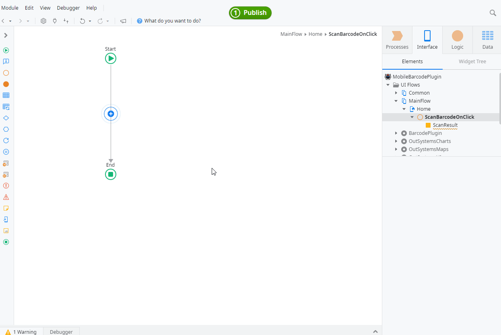
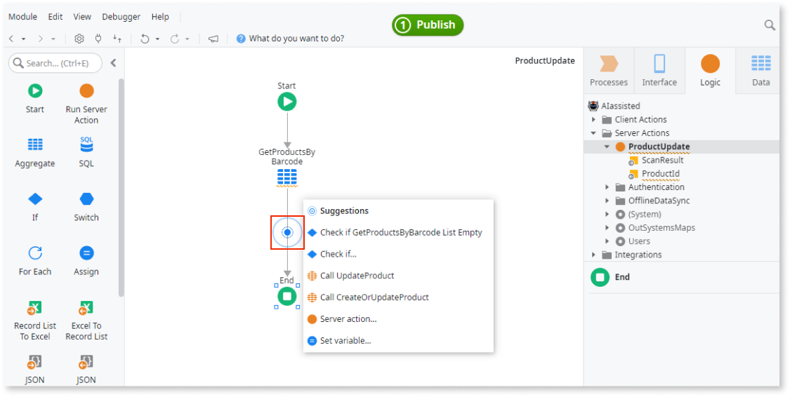
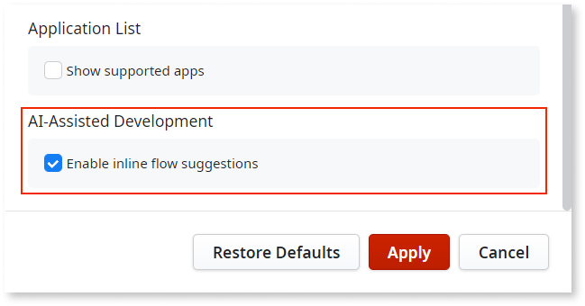
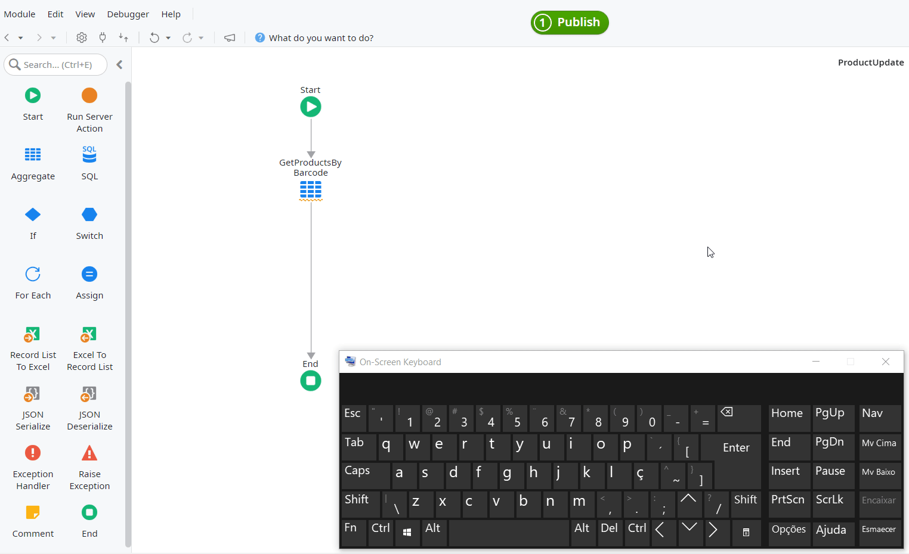
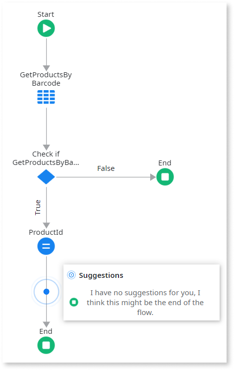
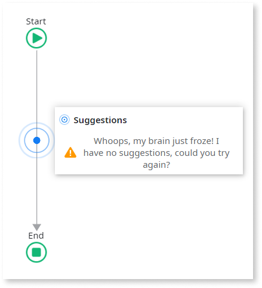

# AI-assisted development

Create app logic in a smart way, with AI-assisted development. This feature helps you develop faster and better with the use of artificial intelligence and machine learning algorithms that analyze millions of anonymized samples of logic. AI-assisted development predicts what you need next and shows the suggestions in the flow connectors when you click the AI radar (the blue circle).

With this feature, you have an AI co-developer available in any flow kind throughout Service Studio. The AI-assisted development also attempts to automatically fill in the properties for the newly created nodes (for example, parameters in a Server Action). When this happens, you'll see the star animation.

The number of provided suggestions varies from one to six, depending on the confidence level of the assistant. When the confidence level about the next element in the flow is high, you see only one suggestion in the list, and you can press the Enter key to insert it immediately.

AI-assisted development can increase your focus and productivity by helping you create logic flows faster and with more confidence, even for complex tasks. Use this feature to create better logic, that is less error-prone and aligned with development best practices. The feature fits well in the low-code paradigm of building OutSystems apps and helps you unlock your development creativity.

## Prerequisites

These are the requirements for using the AI-assisted development feature.

* Service Studio version 11.6.9 or later
* Service Studio can reach the URL `https://api.outsystems.com`

## Using AI-assisted development

There are two ways you can get suggestions.

* Click the AI radar (blue circle) on the flow connectors  

    

* Drag and drop a connector in the flow window  
    
    

### Enabling and disabling the feature

To enable or disable the feature, go to the **Edit** menu in Service Studio and select **Preferences**. In the Preferences window, locate the **AI-Assisted Development** section and check the status of the option **Enable inline flow suggestions**.

When the properties of the selected suggestion are auto-filled you can see the Service Studio stars popping. Check the properties to validate that everything is as you need.

### What kind of suggestions does AI-assisted development give me?

The AI assistant tries to guess what you need next in your flow, based on all the available context and all it has learned from millions of anonymized action flow patterns. When you click on the AI radar, you can expect the following suggestions:

* Specific suggestions - they enable you to add nodes to the flow with pre-filled business context (for example, an Action with populated Source field).
* Generic suggestions - to add nodes that fit the current position in the flow, but they don't contain any business context (for example, a Message node for you to enter text).    

In total, you get between one and six suggestions. If the AI assistant is very confident about what you might need in your next step - it gives you just one suggestion. In general, the number of options varies depending on the assistant's confidence and the information it can extract from the context: the more specific information you add to Actions, the more precise the suggestions are.

	
The suggested nodes have different names than what you might be used to. As an example, Aggregates show as Get Data. This gives a more natural and conversational interface.

### Maximizing the assistant's accuracy

To ensure the best suggestions from the assistant, you should fill in the missing information and context in your action flows to inform it better. In particular:

* The name of your Action flow is relevant for the suggestions, so try to enter it before you start creating the flow. Using a descriptive name can help.
* By creating the variables you believe you need, the input, output and local, you give a valuable context to the assistant and enable it to autofill the parameters.

### Using the keyboard

Once you open the assistant menu, move the suggestion selection with the keyboard arrow keys. Select the highlighted suggestion with the ENTER key.

### High-confidence suggestions

When the certainty level is high, it focuses on the suggestion, so you can press ENTER to add it to the flow.

## Troubleshooting

Here are some troubleshooting tips to help you.

### How can I prevent accidental activations?

If you only want to select the connector, and not activate the suggestions, click outside the connector's center. If the connector is too small (less than two spaces), you can click anywhere in the connector.

### What does it mean when there are no more suggestions?

When there's nothing more to add, and it's not the end of the flow, you can edit your flow manually.

### Why do I have to click again to get suggestions?

If this keeps happening, check your internet connection and try again.

### Why isn't the AI radar showing up?

The AI suggestion node may not show because:

* Your Service Studio version is not up to date
* There's no working internet connection or there are temporary connection issues
* You deactivated the feature in the Service Studio preferences
* Your operating system does not use the TLS 1.2 protocol.

### Why does the AI radar disappear?

If there's a recurring error or a poor Internet connection, the AI radar is temporarily deactivated to ensure your Service Studio experience runs smoothly.
