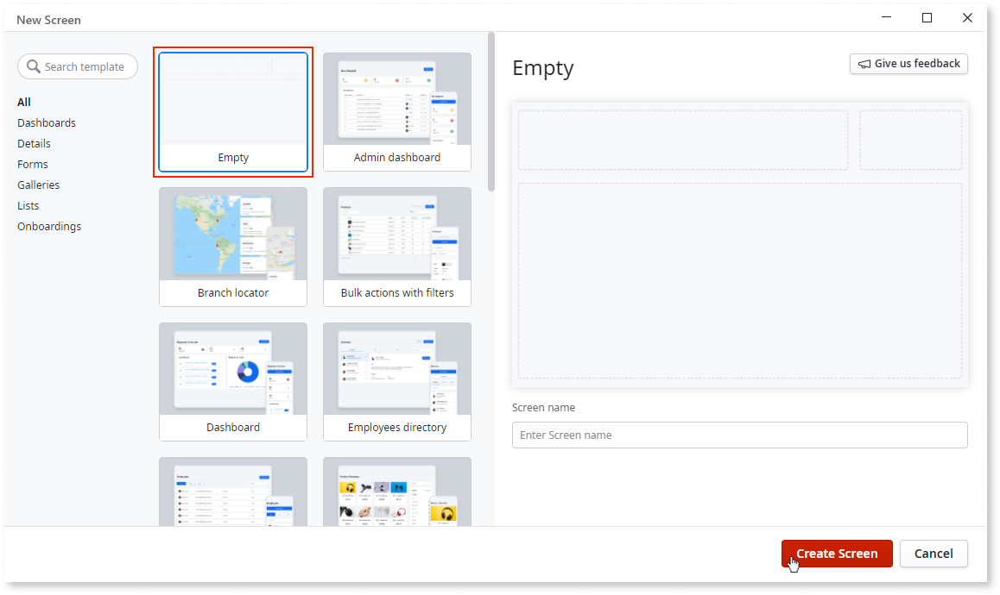
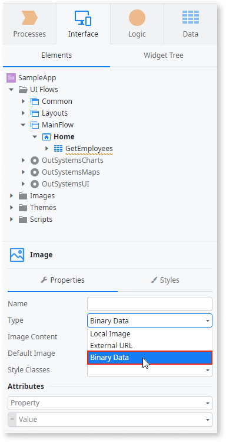

# Display an Image Stored in the Database

You can display different types of images in your applications such as static images, external images fetched from URLs, and images stored in the database.

## In Reactive Web and Mobile

To display a database image in Reactive Web and Mobile:

1. Open the screen where you want to display the image. 

 

 

2. Check if there is an aggregate fetching the image from the database. Add the aggregate if needed. 

 

3. Drag the Image widget from the toolbox to the screen. 

 

4. Set the property Type to `Binary Data`. 

 

5. Set the property Image Content to the entity attribute that stores the image.

  

## In Traditional Web

To display a database image in Traditional Web:

1. Open the screen where you want to display the image.
1. Check if there is an aggregate fetching the image from the database. Add the aggregate to the Preparation if needed.
1. Drag the Image widget from the toolbox to the screen. 
1. Select an existing image resource or import a new image as an image default. This image is used as a placeholder during design time and as default during runtime. 
1. Select the image and change its property Type to `Database`.
1. Set the Attribute property to an entity attribute of type `Binary Data` that stores the image in the database. 
1. Set the Filename property to the name of the file when the end user saves the image.
1. Set the Entity Identifier property to the identifier of the specific entity record that contains the image to display. 
