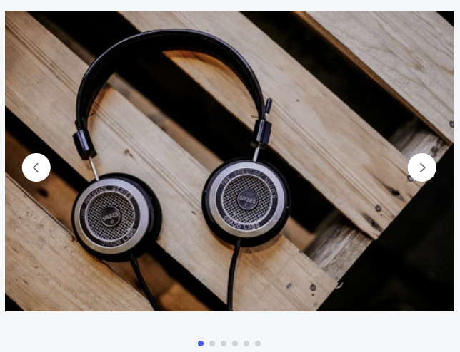
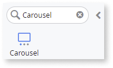

# Carousel

You can use the Carousel UI Pattern to display multiple items in a horizontal slide.  The Carousel Pattern optimizes screen space by displaying only a few images from a larger collection which you can view using the navigation controls. 

**Note:** The Carousel Pattern is based on the Splide.js library (v3). For more information about the Carousel’s behaviors and extensibility methods, see [Splide.js](https://splidejs.com/).  

## How to use the Carousel UI Pattern

1. In Service Studio, in the Toolbox, search for `Carousel`.
  
     The Carousel widget is displayed.

    

    If the UI widget doesn't display, it's because the dependency isn't added. For example, if you are using a ready-made app, it deletes unused widgets from the module. Make the widget available in your app:

    1. In the Toolbox, click **Search in other modules**.

    1. In **Search in other Modules**, select the widget you want to add from the **OutSystemsUI module**, and click **Add Dependency**.

    1. In the Toolbox, search for the widget again.

1. From the Toolbox, drag the Carousel widget into the Main Content area of your application's screen. 

    

    By default, the Carousel pattern contains a **CarouselItems** placeholder with a **List** widget and **Image** widget. If you want a Carousel with static images, you can remove the **List** widget and add your images inside the **CarouselItems** placeholder.

1. Add your content to the **Carousel Items** placeholder. 

    In this example, the List is deleted and 3 Image widgets are added.  

     

1. Select the **Image** widget, and on the **Properties** tab, from the **Image** drop-down, select or import the image you want in the Carousel. 

    **Note:** In this example, the image Type is set to Local image. You can also add External and Binary Data images. In this example, the image property Type is set to **Local** image. You can also add [External and Binary Data](../../../image/display-image.md) images.   

       

1. Repeat step 4 for each of the images in the Carousel. 

1. You can configure the Carousel by selecting the pattern, and on the **Properties** tab, set the relevant (optional) properties, for example, **Navigation** or **ItemsPerSlide**.For more configurations, expand the **OptionalConfigs** property.

      

After following these steps and publishing the module, you can test the pattern in your app.

## Properties

|**Property**|**Description**|
|---|---|
|Navigation (CarouselNavigation Identifier): Optional | Sets the navigation behavior:<ul><li>Dots</li><li>Arrows</li><li>Both (dots and arrows)</li><li>None</li></ul>|
|Height (Text): Optional|Set a custom height for the Carousel. The parameter accepts any CSS format, except percentage (library constraint). The default value is Auto (he height of the items inside Carousel).|
|ItemsPerSlide (CarouselItems): Optional|Number of Carousel items simultaneously visible on each slide.<ul><li>DesktopItems (Integer)</li><li>TabletItems (Integer)</li><li>PhoneItems (Integer)</li></ul>|
|ExtendedClass (Text): Optional| Adds custom style classes to the Pattern. You define your [custom style classes](../../../../../develop/ui/look-feel/css.md) in your application using CSS.  Examples <ul><li>Blank - No custom styles are added (default value).</li><li>"myclass" - Adds the ``myclass`` style to the UI styles being applied.</li><li>"myclass1 myclass2" - Adds the ``myclass1`` and ``myclass2`` styles to the UI styles being applied.</li></ul> You can also use the classes available on the OutSystems UI. For more information, see the [OutSystems UI Cheat Sheet](https://outsystemsui.outsystems.com/OutSystemsUIWebsite/CheatSheet). |
|OptionalConfigs.AutoPlay (Boolean)|If True, the Carousel slides change automatically. If False, slides must be changed manually. The default value is True.|
|OptionalConfigs.Loop (Boolean)|If True, once the last item in the Carousel is reached, it loops around to the first item and begins displaying all of the items again. If False, the Carousel does not loop; it ends when the last item is reached. The default value is True.|
|OptionalConfigs.Padding (Text)|Distance between the Carousel edges and the visible items on each slide. Accepts any CSS size unit (such as, px, vw, %) or  CSS variables, for example, "100px".|
|OptionalConfigs.ItemsGap (Text) |Distance between each Carousel item. Accepts any CSS size unit (lsuch as px, vw, %) or CSS variables, for example, "var(--space-base)".|
|OptionalConfigs.StartingPosition (Integer)|Set the first item to display first in the Carousel.|
  
## Compatibility with other patterns

Avoid using the Carousel inside patterns with swipe events, such as the Tabs and Stacked Cards Patterns.
