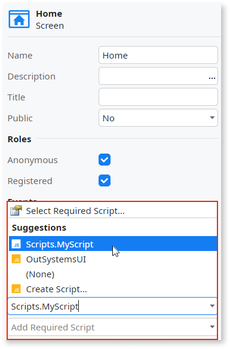

# Use JavaScript Code from an External Library

Applies only to Mobile Apps and Reactive Web Apps

OutSystems doesn't recommend using JavaScript libraries that directly manipulate the DOM, such as jQuery. Such libraries can break Reactive and Mobile apps and make them difficult to maintain.

Before using JavaScript code from an external library or contained in a `.js` file, do the following:

1. Import or create a script under the **Scripts** tree folder. This script may reside in the module (that is, it was created using the context menu options "Create Script" or "Import Script", when right-clicking the "Scripts" folder), or can be a reference to a script defined in another module.

    

1. In the **Interface** tab, select the screen/block where you want to add the JavaScript code, and its properties select the script in the **Required Scripts** property:

    

The script added as a required script is evaluated in the global scope. Thus, you can use functions and objects initialized in this script in any JavaScript element of the screen/block.

## Demo

This demo shows how you can easily add a reference to an external javascript and then use it in your app.

<iframe width="560" height="315" src="https://www.youtube.com/embed/xmvxkkkDL5E" frameborder="0" allow="accelerometer; autoplay; clipboard-write; encrypted-media; gyroscope; picture-in-picture" allowfullscreen="allowfullscreen"></iframe>
