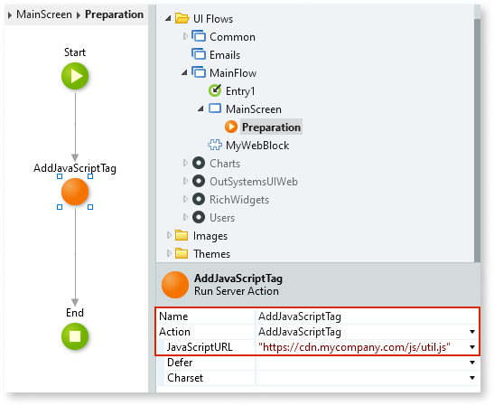

# Extend Your Web Application Using JavaScript

in Traditional Web Apps, you can define JavaScript code in three different elements, with different scopes:

* Globally for the Module
* For a Web Screen
* For a Web Block

When you deploy your web app, OutSystems creates separate files for the JavaScript code defined at these three levels: Module, Web Screen, and Web Block level.

Each rendered HTML page (corresponding to a Screen in your Traditional Web App) includes these JavaScript files by adding `<script>` tags inside the `<head>` element of the page. This means that the browser interprets the JavaScript code **before** loading all the elements in the page.

Check how to [Define and Run JavaScript Code](run-js-code.md) in your Traditional Web App.

## Define JavaScript code in the Module

## Include a JavaScript file hosted elsewhere

Besides defining JavaScript code in one of the supported elements (Module, Web Screen, or Web Block) you can also reference an existing JavaScript file, hosted elsewhere, in a Screen of your OutSystems web application.

Do the following:

1. Get the full URL of the JavaScript file you wish to include in a Screen of your app.

    For example:  
    `https://cdn.mycompany.com/js/util.js`

1. Add the [AddJavaScriptTag](../../../ref/apis/auto/httprequesthandler-api.final.md#AddJavaScriptTag) Server Action of the HTTPRequestHandler API as a dependency of your module. Check [Reuse functionality from other modules](../../../develop/reuse-and-refactor/expose-and-reuse.md#reuse) for more information.

1. In the **Preparation** of the Screen where you want to include the JavaScript code, add a call to the "AddJavaScriptTag" Server Action. Set the **JavaScriptURL** argument to the URL you previously identified.

    
