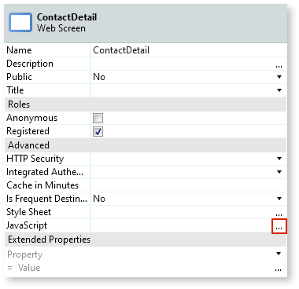

# Define and Run JavaScript Code

To run JavaScript code in your web app, you need to:

* add the code in one of the supported elements
* call one or more JavaScript functions specified in that JavaScript code block

## Adding JavaScript code

To add or edit the JavaScript code in a Module, Web Screen, or Web Block, do the following:

1. Select the element in the element tree where you want to add or edit JavaScript code.

1. In the properties pane, click **...** (ellipsis) on the **JavaScript** property to open the JavaScript editor.

The example below shows a JavaScript function defined locally for a Web Screen:

## How to run JavaScript code

You can run JavaScript code in your web application in the following ways:

* Using the Extended Properties of Web Screens or widgets
* Within unescaped Expressions
* Using the [RunJavaScript](../../../ref/apis/auto/httprequesthandler-api.final.md#RunJavaScript) action of the HTTPRequestHandler API

In all the cases, the JavaScript code runs in the context of the browser.

### Extended Properties example

The example below shows a JavaScript function invoked when the `onclick` event occurs in a button:

Since the value of an Extended Property is an expression, you can also type the JavaScript source code directly as the **Extended Property** value:

### Unescaped Expressions example

You can use unescaped Expressions to add JavaScript at a specific point of your Web Screen, setting the **Escape Content** property to **No**:

### RunJavaScript action example

In your Action Flows, either in a Screen Action or a Server Action, you can use the [RunJavaScript](../../../ref/apis/auto/httprequesthandler-api.final.md#RunJavaScript) action of the HTTPRequestHandler extension to get your JavaScript code to run in the context of the browser:

