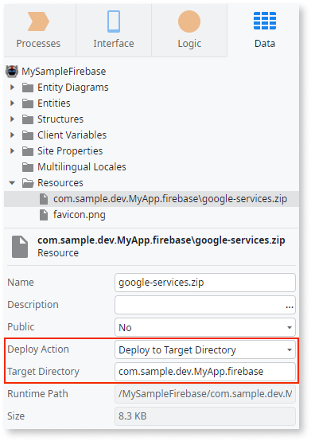
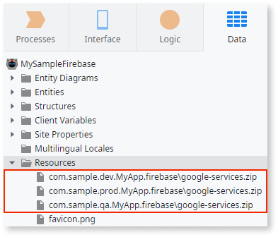
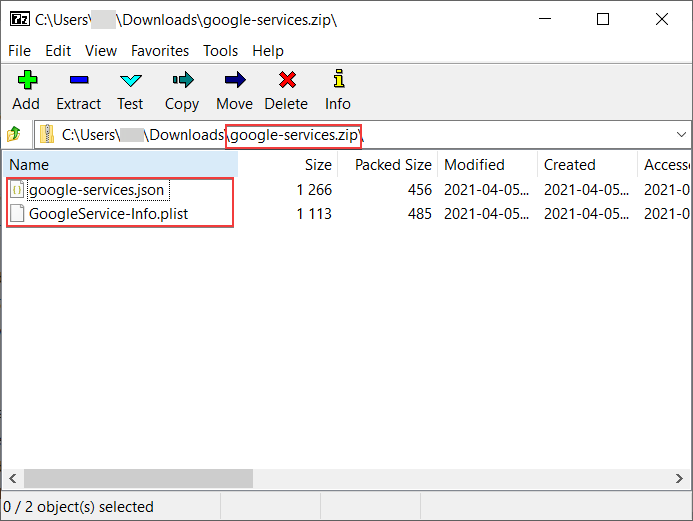

# Firebase Plugins

<div class="info" markdown="1">

Applies only to Mobile Apps.

</div>

Firebase is a Google mobile development platform. It speeds up development of many development patterns for mobile apps. You can use Firebase in the OutSystems mobile through the following Firebase-based plugins:

* [Analytics](https://www.outsystems.com/forge/component-overview/10704/firebase-analytics-plugin)
* [Crash Reporting](https://www.outsystems.com/forge/Component_Overview.aspx?ProjectId=10705)
* [Dynamic Links](https://www.outsystems.com/forge/component-overview/10988/dynamic-links-plugin-firebase)
* [Performance Monitoring](https://www.outsystems.com/forge/Component_Overview.aspx?ProjectId=10706)
* [Firebase Cloud Messaging](https://www.outsystems.com/forge/component-overview/12174/cloud-messaging-plugin-firebase)

<div class="info" markdown="1">

To migrate your app from the unsupported Firebase Mobile plugin, see [Migrating to the supported Firebase-based mobile plugins](https://success.outsystems.com/Support/Enterprise_Customers/Upgrading/Migrating_to_the_supported_Firebase-based_mobile_plugins). 

</div>

## Prerequisites

To use the Firebase plugins you meet the following requirements:

* You set up a Firebase project in the [Google Firebase console](https://console.firebase.google.com/).
  
* You [added an Android and an iOS app in Firebase](https://support.google.com/firebase/answer/9326094?hl=en) and downloaded the configuration files:

    * **GoogleService-Info.plist** for iOS
    * **google-services.json** for Android

## Demo app

Install [Firebase Mobile Sample App](https://www.outsystems.com/forge/component_overview.aspx?projectid=10707&projectname=firebase-mobile-sample-app) from Forge and open the app in Service Studio. The demo app contains logic for common use cases, which you can examine and recreate in your apps. If you want to build the app and run it, check the prerequisites in the Forge page.

## Adding and using a Firebase plugin

To add a Firebase plugin to your module, follow these steps:

1. Install the plugin and reference it in your module. See [Adding plugins](../intro.md#adding-plugins) for detailed instructions.

1. Add the [Google services configuration file](#adding-google-services-configuration-file) to the module.

    <div class="info" markdown="1">

    You need to add Google services configuration file only for the first Firebase plugin in your module. The next Firebase plugin you add uses the same configuration files. 

    </div>

1. In Service Studio, go to **Logic** > **Client Action** > **your Firebase plugin** and use the actions in your logic.

    

    <div class="info" markdown="1">

    To learn how to use the **Firebase Cloud Messaging plugin**, check this [article](firebase-messaging.md).

    </div>

## Adding Google services configuration file

An app with a Firebase Plugin requires the plugin configuration files in the app file resources. Follow the steps to add the Firebase configuration to your module:

1. In Service Studio, go to the **Data** tab.

1. Right-click the **Resources** folder and select **Import Resource**. The **Import Resource** dialog opens.

1. Select the [google-services.zip firebase configuration file](#preparing-firebase-configuration-file) and confirm the selection. Service Studio adds the file under the **Resources** folder.

    

1. Select the **google-services.zip** resource and configure the following:
   
    * In the **Deploy Action** list, select **Deploy to Target Directory**.
    * In the Target Directory, enter the [target directory for your environment](#generating-target-directories-for-configuration-files).

    

1. Repeat steps two and four for each environment, each time using a different configuration and [target directory](#generating-target-directories-for-configuration-files).

    

### Preparing Firebase configuration file

Add the files **GoogleService-Info.plist** and **google-services.json** in a zip file and name the zip file **google-services.zip**. 



### Generating target directories for configuration files

A Firebase Plugin requires that you supply configuration files in the app file resources. The mobile apps commonly have different identifiers in different environments, so you need to generate target directories for each environment.

To get the target directory, concatenate the **app identifier** and **.firebase**. Here are examples for three environments with different app identifiers.

| Environment | App identifier | Target directory |
| - | - | - |
| DEV | com.sample.dev.MyApp | `com.sample.dev.MyApp.firebase` |
| QA | com.sample.qa.MyApp | `com.sample.qa.MyApp.firebase` |
| PROD | com.sample.prod.MyApp | `com.sample.prod.MyApp.firebase` |

Use the target directory value in the **Target Directory** property of the **Resource**.

### Additional setup for the Dynamic Links Plugin

The Firebase Dynamic Links Plugin has some additional setup steps that need to be followed for it to work correctly:

* You need to include a global preference in the Extensibility Configurations of the application using the plugin. The value for this preference needs to match the URL prefix you set in the Dynamic Links page in the Firebase console. For example:

    ```JSON
    {
        "preferences": {
            "global": [{
                "name": "FIREBASE_DOMAIN_URL_PREFIX",
                "value": "outsystemsfirebase.page.link"
            }]
        }
    }
    ```

* For iOS, you need to use a provisioning profile from Apple that contains the Associated Domains capability. For more info, see [Configuring an Associated Domain](https://developer.apple.com/documentation/xcode/configuring-an-associated-domain) by Apple.

### Ensuring app is compliant with Apple’s Data Use and Sharing guidelines

Starting with iOS 14.5, apps on the App Store must receive the user’s permission to collect tracking data through the AppTrackingTransparency framework.


To trigger the native AppTrackingTransparency framework, use the **RequestTrackingAuthorization** client action from the Firebase Analytics Plugin. Apple reccomends triggering this prompt as soon as the app loads.
If you want to present an alert prior to the iOS tracking permission dialog, enable the **ShowInformation** parameter on the action. To provide more context to app users in the dialog, set a **Title** and **Message**.

By default, the **NSUserTrackingUsageDescription** field is set to `AppName needs your attention.`. You can set your custom description by including an iOS-specific preference (`USER_TRACKING_DESCRIPTION_IOS`) in the Extensibility Configurations of the application, as follows:
    
```JSON   
{
    "preferences": {
        "ios": [{
            "name": "USER_TRACKING_DESCRIPTION_IOS",
            "value": "This is an example of a description."
        }]
    }
}
```

You can use the **RequestTrackingAuthorization** action multiple times in the same app, since iOS remembers users' choice and only prompts users again after they uninstall and then reinstall the app on the device.
    
By default, an app using the Firebase Analytics plugin is able to trigger the native AppTrackingTransparency framework. It also contains the **NSUserTrackingUsageDescription** field in the app's **\*-Info.plist** file. If you don't want to trigger the framework, and don't want to include the description field in the **.plist** file, you can disable this through the Extensibility Configurations like this:
    
```JSON   
{
    "preferences": {
        "ios": [{
            "name": "EnableAppTrackingTransparencyPrompt",
            "value": "false"
        }]
    }
}
```

It is important to note that if your app collects user data for adversiting purposes, also know as Attribution within Firebase Analytics context, it should prompt the AppTrackingTransparency framework.
