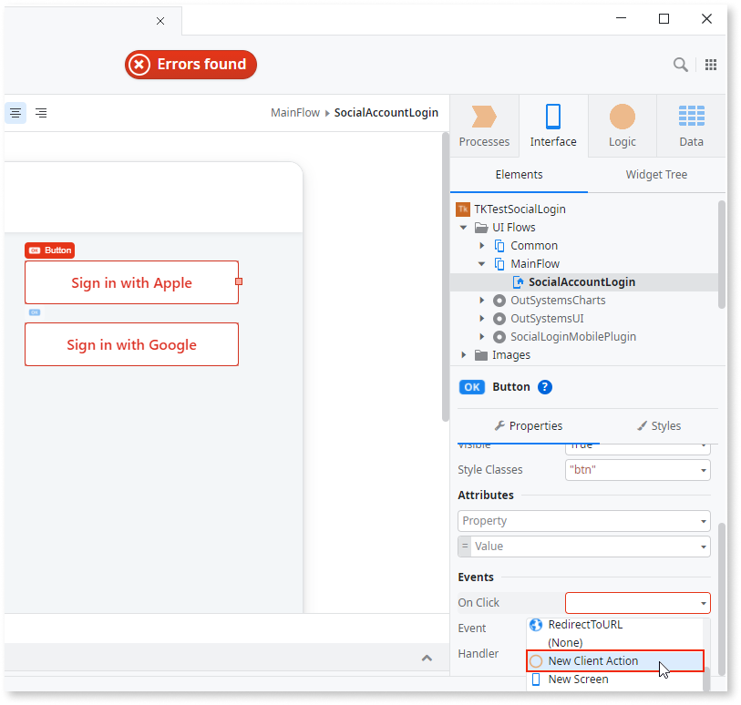
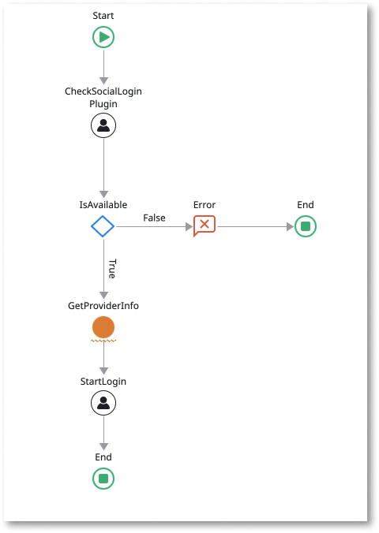

---
summary:
---

# Social login plugin

The Social Login plugin lets you set a login experience that uses an external provider, namely Google, Apple, Facebook, or LinkedIn. The plugin enables you to request access to a subset of your user's data stored by the provider, such as name, email, and profile picture. You can then use this information to create or start a user session on your app.

As a good practice, verify the plugin is available during runtime in your app to prevent the app from crashing. Use the **Logic** > **Client Actions** > **SocialLoginPlugin** > **CheckSocialLoginPlugin** action to check for the plugin availability. If the plugin isn't available to the app, display an error to your users.

To learn how to install and reference a plugin in your OutSystems apps, and how to install a sample app, see [Adding plugins](../intro.md#adding-plugins).

## Sample app

OutSystems provides a sample app that contains logic for common use cases. Install the Social Login sample app from Forge and then open it in Service Studio.

This sample app shows you how to do the following:

* Trigger a native social login flow using Apple Sign-In, Google Sign-In, or Facebook Login.

* Trigger a Progressive Web App (PWA) social login using Apple, Google, Facebook, or LinkedIn as providers.

* Use the profile info (including name, email, and profile picture) returned by the provider on a screen.

The next step in the development of a mobile app is to use the profile info (including name, email, and profile picture) returned by the provider to create a user or manage a session on the OutSystems Users service. This is not shown in the sample app, but it can be done resorting to the User systems database and its entity actions.

## Enable a frictionless social login experience in your app

The following steps show how to enable your users to log in to your app using an existing social media account:

1. [In Social Login Configurator, set up social login providers for your app](#set-providers).

1. [In your app, create a button and logic to trigger social login flows](#login-flow).

1. [In your app, handle authentication response and login scope](#auth-response).

1. Optionally, in your app, create logic to use the profile info (including name, email, and profile picture) returned by the provider to create a user or manage a session on the OutSystems Users.

### Set up social login providers for your app { #set-providers }

Before being able to provide the option for social login in an app, you need to configure a new provider to be used in that app. For that, you can use our Social Login Configurator, a Reactive Web app that lets you set up a new provider to use on your app.

Access Social Login Configurator, by ...add steps

To configure a new provider or edit an existing one you need to add the following information (depending on the provider).

#### Apple

Relevant Information | Description
---|---
Identifier | A public identifier your app on the provider side. It is a string type value available to any registered developer on Apple Developer. You can access the Identifier value on the Certificates, Identifiers, and Profiles pages of your app.
Key ID | ...
Team ID | Identifier of your team on Apple Developer.
Secret (`.p8`) | A confidential code known only to your app and the authorization server. It is a string type value type value available to any registered developer on Apple Developer. You can access the Secret value on …

Check information on OAuth configuration of Apple login in [Getting Started - Sign in with Apple - Apple Developer](https://developer.apple.com/sign-in-with-apple/get-started/).

#### Google

Relevant Information | Description
---|---
Client ID | A public identifier your app on the provider side. It is a string type value available to any registered developer on the Google Cloud Platform. You can access the ClientID value on the OAuth Consent tab on your app's Credentials screen.
Client Secret | A confidential code known only to your app and the authorization server. It is a string type value type value available to any registered developer on the Google Cloud Platform. You can access the ClientSecret value on the OAuth Consent tab on your app's Credentials screen.

Check information on OAuth configuration of Google login in [Start Integrating Google Sign-In into Your Android App](https://developers.google.com/identity/sign-in/android/start-integrating).

#### Facebook

Relevant Information | Description
---|---
App ID | A public identifier your app on the provider side. It is a string type value available to any registered developer on Meta for Developers. You can access the AppID value in your app's settings.
App Secret | A confidential code known only to your app and the authorization server. It is a string type value available to any registered developer on Meta for Developers. You can access the AppSecret value in your app's settings.

Check information on OAuth configuration of Facebook login in [Facebook Login - Documentation - Facebook for Developers](https://developers.facebook.com/docs/facebook-login/).

#### Linkedin

Relevant Information | Description
---|---
Client ID | A public identifier your app on the provider side. It is a string type value available to any registered developer on LinkedIn Developer. You can access the Identifier value on the "Authentication" side navigation link, underneath the header "Authentication Keys".
Client Secret | A confidential code known only to your app and the authorization server. It is a string type value available to any registered developer on LinkedIn Developer. You can access the Identifier value on the "Authentication" side navigation link, underneath the header "Authentication Keys".

### Create a button and logic to trigger social login flows { #login-flow }

The plugin triggers a social login flow through the **StartLogin** client action.

To enable social logins in your app's login screen, do the following:

1. In your app's login screen, add a **Button** for each social login provider you want to enable.

1. For each button you added in the previous step, add an action to handle the **On Click** event. In the properties of each social login button, open the **Events** > **On Click** dropdown and select **New Client Action**.

1. In the action flow of each action you created in the previous step, check if the plugin is working properly during runtime. After the **Start** node, add a **CheckSocialLoginPlugin** action.

1. Handle the response from CheckSocialLoginPlugin. After **CheckSocialLoginPlugin**, add an **If**.

1. Set the **Condition** of the **If** to `CheckSocialLoginPlugin.IsAvailable`.

1. In the **False** branch of the **If**, add a **Message**, set the message **Type** to `Error`, and set a **Message** to be show to end users.

1. Connect the **Message** to an **End**.

1. In the **True** branch of the **If**, add a **StartLogin** action.

1. Connect **StartLogin** to an **End**.

    

1. In the properties of **StartLogin** action, set the values for the  mandatory inputs:

    Provider
    :   The social login provider.

    ClientID
    :   A text type value available to any registered developer on the Provider development platform. You can access the ClientID value on the settings of your OAuth configuration.

    RedirectURI
    :   A text type value that will send you the authorization result for any backend service you may be using. You can specify the RedirectURI on the settings of your Provider OAuth configuration.

        The Redirect URI is a combination of your environment URL and the **AuthenticationRedirect** URL. Get the **AuthenticationRedirect** URl, by opening the Social Login Configurator app in Service Studio, and then in the **Logic** tab, go to **REST integration** > **SocialLoginAuth**. An example of a RedirectURI is:

        `https://enmobile11-dev.outsystemsenterprise.com/UXTestsSocialLoginCore/rest/SocialLoginAuth/AuthenticateRedirectLinkedIn`

<!---
You can also define the optional variable of:

ReturnURI
:   An URL type value, necessary for cases where the screen that uses the profile information is different from the screen where the action is being used. You can specify the ReturnURI directly on the StartLogin action.
--->

### Handle authentication response and login scope { #auth-response }

For your app to handle failed login attempts and access the output information of a social login, also known as login scope, you need add an **Authenticate** block to the screen where the StartLogin action occurs. Then you need to create an action to handle the OnAuthenticationCompleted event.

After setting up your block handler, you can use the login scope by passing the OnAuthenticationCompleted block variables to any destination of your choice.

The login scope includes the following variables:

Scope | Variable type | Description | Additional Info
---|---|---|---
ID | Text | User's ID stored by the social login provider. |
FirstName | Text | User's first name stored by the social login provider. |
LastName | Text | User's last name stored by the social login provider. |
Email | Text | User's email stored by the social login provider. |
Picture | URL | User's profile picture stored by the social login provider. | Not available for Social Logins with Apple
Token | Text | User's access token stored by the social login provider. |

## Known issues and workarounds

Check the following known issues and possible workarounds.

### Compatibility with operative systems

Applies to iOS only.

The native login flow is only available for iOS 13 and later versions. For earlier versions, use the PWA login flow.

### Required use of JSON files

Applies to the following social login providers and app type combinations:

Social Login provider | App Type
---|---
Apple | Android
Google | iOS
Facebook | Android, iOS
LinkedIn | Android, iOS

For these combinations, you need to include a JSON configuration file in the **Resources** folder of your app.

Get the JSON configuration file, **SocialLoginsConfigurations.json**, from the **App Details** on your **Social Login Configurator**.
