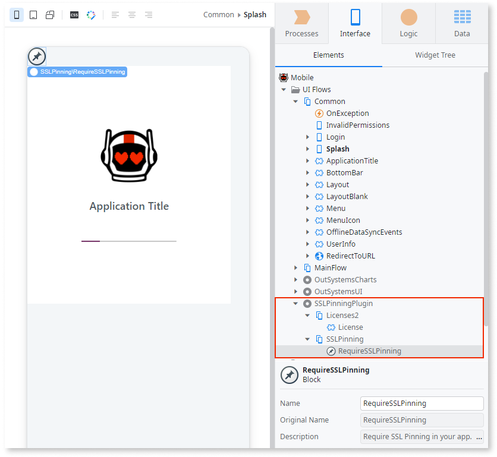

# SSL Pinning Plugin

In mobile apps, SSL Pinning or HTTP Public Key Pinning (HPKP) provides an extra layer of security to HTTPS communications to avoid, for example, man-in-the-middle attacks. SSL Pinning works client-side and verifies the server certificate by comparing hashes of public keys that are pre-bundled with the mobile app.

Keep in mind that, by design, calls to server actions stop working if there's a hash mismatch. In this case, you need to add a new hash list in the app, build a new version of the app, and distribute it to your users. To anticipate the hash mismatches, you can design the app so that it checks if the certificate is valid or not. For more information, see [Check the hash validity](#check-the-hash-validity) section.

SSL Pinning uses a customized version of the SSL certificate validation and doesn't rely on deprecated SSL Pinning in browsers.

**Note** Don't use the SSL Pinning plugin in production with the default certificate provided by the OutSystems cloud as your apps won't work when OutSystems renews the certificate. In general, you should always use the certificate for which you have the certificate keys.

## How to implement SSL pinning in OutSystems

To implement SSL Pinning you must have two certificates on the server - one as the primary certificate and the second as backup (in case the primary certificate gets compromised).

To implement SSL Pinning, follow these steps:

1. Generate hashes for the public keys of the certificates.

1. Create a configuration file with the hashes.

1. Install the SSL Pinning from Forge.

1. Add the configuration file to your mobile app.

1. Validate that certificates are working only for the hashes in the mobile app.

### Generate the hashes for public keys

To generate the hash of a public key in a certificate, get the certificate from the server and use [OpenSSL](http://slproweb.com/products/Win32OpenSSL.html) commands to do the following:

1. Obtain the public key from the certificate.

1. Calculate hash of the public key using the SHA-256 algorithm.

1. Encode the hash of the public key in Base64.

Here is an example of the openSSL commands to generate the hash of the certificate public key.

`openssl x509 -in my-certificate.crt -pubkey -noout | openssl rsa -pubin -outform der | openssl dgst -sha256 -binary | openssl enc -base64`

For more examples of the openSSL commands, check out this [Mozilla](https://developer.mozilla.org/en-US/docs/Web/HTTP/Public_Key_Pinning#extracting_the_base64_encoded_public_key_information) page or [this script](https://github.com/datatheorem/TrustKit/blob/master/get_pin_from_certificate.py) in GitHub.

### Create the configuration file

Create a JSON configuration file and populate it with hashes and the server addresses. Use the following format:

    {

        "hosts": [{

            "host": "www.example.com",

            "hashes": [

                "sha256/AAAAAAAAAAAAAAAAAAAAAAAAAAAAAAAAAAAAAAAAAAA=",

                "sha256/BBBBBBBBBBBBBBBBBBBBBBBBBBBBBBBBBBBBBBBBBBB="

                ]

        }]

    }

when creating the configuration file, keep the following in mind:

* The JSON structure must be as provided in this document.

* The file must have a .json extension, for example, pinning.json.

* Insert the full hostname of your server.

* No subdomains are allowed in the host.

* Each host must have at least two hash keys.

* Prefix the hashes with sha256/;

* Only unique hash keys are allowed for iOS.

If you're using the [OutSystems personal environment](https://success.outsystems.com/Support/Personal_Environment/What's_an_OutSystems_personal_environment.), use a dummy text for the second hash key, as there’s only one certificate and hash key available for this environment.

### Add the configuration file to the app

Add the configuration file to the mobile app, so that the build service can bundle the configuration in the native app build.

In Service Studio, complete the following steps in the mobile app: 

1. Add a resource with the configuration file. Only use 1 JSON configuration file as a resource otherwise the pinning may not work as expected.

1. Set the **Deploy Action** property to **Deploy to Target Directory**.

1. Set the **Target Directory** property to pinning (no quotes).

    

### Implement additional verification of the server certificate

To add the SSL Pinning verification, you must install the SSL Pinning component from [Forge](https://www.outsystems.com/forge/) in your environment. 

  

In Service Studio, complete the following steps in the mobile app:

1. Go to Manage Dependencies (Ctrl+Q) and add the reference to SSLPinningPlugin.

1. Drag the RequireSSLPinning block to one of your screens. SSL Pinning works for all HTTPS requests in the mobile app. The **Splash** screen is a good place to add the block.

### Check the hash validity

Calls to server actions stop working if there's a hash mismatch. It's good practice to check for hash validity, and if there's a mismatch, tell the users they need to get the new version of the app. Use the client action **CheckCertificateForUrl** to check if a hash from the configuration list is valid or not. If the check doesn't pass, display a notification telling users to install a new version of the app.

By default, the **CheckCertificateForUrl** action evaluates the URL of the current environment. You can optionally enter a value for the URL parameter. 

The action returns the following 2 values:

* Success. Boolean. True if the connection to the server was successful.

* Error. Error Structure. Optional, available if there's an error during the request to the server. The values are "SSLPinning found an issue with the configured certificate for the url!" (when there's a problem with the configured hash value) and "Message: SSLPinning found some problem with the request!" (a generic error that requires troubleshooting).

### Test the SSL Pinning

To test the mobile app with SSL Pinning, complete the following steps:

1. Publish and generate the new version of your mobile app with SSL Pinning.

1. Install and run the app on your smartphone. 

1. Verify that the app works (it has the right certificate and hash keys).

To see SSL Pinning reject a certificate, complete the following steps:

1. Edit the configuration file and tamper with the hashes, for example, change one character in each hash.

1. In your mobile app:

    * Remove the resource with the old configuration file.

    * Add a resource with the new configuration file (don’t forget to set the properties).

    * Publish and generate the new version.

1. Install and run the new version on your smartphone.

1. The mobile app won’t work because the SSL Pinning raises an error due to an invalid certificate.

## SSL pinning for multiple servers

If you want your mobile app to perform SSL Pinning validations while connecting to multiple servers, complete the following steps:

1. For each server, get its two certificates and generate their hashes.

1. Create the configuration file in the following JSON format:

    {

        "hosts": [{

            "host": "www.myserver1.com",

            "hashes": [

                "sha256/AAAAAAAAAAAAAAAAAAAAAAAAAAAAAAAAAAAAAAAAAAA=",

                "sha256/BBBBBBBBBBBBBBBBBBBBBBBBBBBBBBBBBBBBBBBBBBB="

                ]

        },{

            "host": "www.myserver2.com",

            "hashes": [

                "sha256/CCCCCCCCCCCCCCCCCCCCCCCCCCCCCCCCCCCCCCCCCCC=",

                "sha256/DDDDDDDDDDDDDDDDDDDDDDDDDDDDDDDDDDDDDDDDDDD="

                ]

        },

        ...

        ]

    }

1. Bundle the configuration file and implement the verification in your mobile app (as explained for a single server).

## Plan for the certificate renewal

If you're planning to update your certificate soon, release a new version of the app with the JSON configuration that contains the hash values for both the current certificate and the new certificate. Do this before you update the certificate to give enough time for your users to update the app. This way, once you update the certificate, the app continues to work.

## Limitations

This section is about limitations of the plugin.

### Blob object and Android

Currently, handling [Blob](https://developer.mozilla.org/en-US/docs/Web/API/Blob) objects isn't supported in Android when SSL Pinning is enabled.