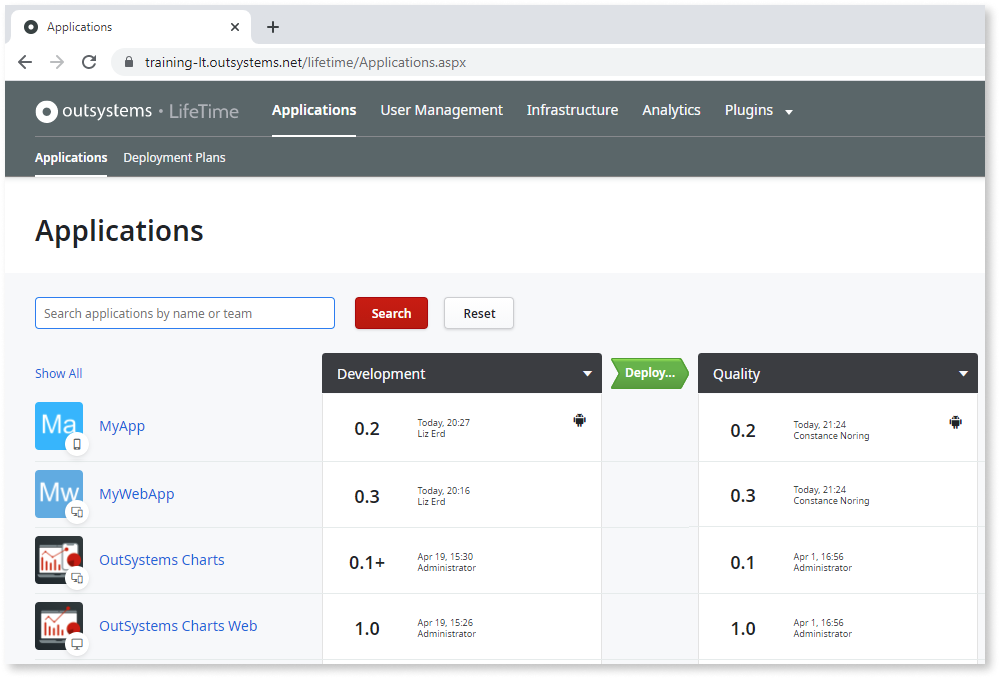
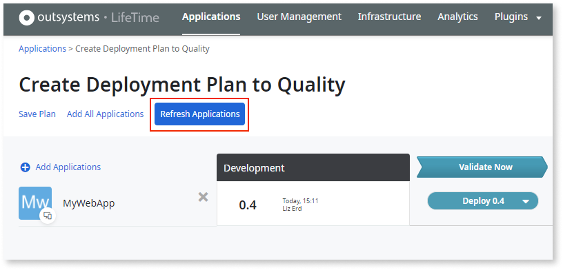

# Deploy an Application

In LifeTime, deployment of an application's [tagged version](<tag-a-version.md>) takes a version of the application from one environment and deploys it in another. Just select the tagged version of the application and LifeTime deploys it in the exact development state in which it was tagged.

## Deploy a Web and a Mobile Application

You can use any name for your environments. In this example, Development, Quality, and Production are being used.

In this example, we are creating an application in Development and then moving it to Quality for testing, and then  to Production.

A milestone is reached and the application is ready for testing by the Quality team. LifeTime tags [tags](<tag-a-version.md> our application with the next version number as follows:

To deploy the application to Quality, do the following:

1. From Lifetime, click **Applications**.
1. In the search box, you can search by application name or tam and click **Search** or you can click **SHow All** to see a list of available applications.

     

1. CLick on the name of one or more applications that you want to deploy.
1. In the Development environment, below the version information, click the **Tag Version** button.

    

1. In the Development screen, enter a version number and description of your App. Then click **tag Version**.

    

1. To finalize the deployment, click the **Deploy. . .** button.

    

OutSystems displays the workflow, showing where you are in the deployment process. You can validate, deploy the version, or do nothing.

  

## Create Deployment Plan to Quality

To continue the deployment process, follow these steps.

1. From the Deployment Plan screen, click **Validate Now**. The system validates the deployment to Quality.

If LifeTime detects any changes in the applications included in the plan either in the source or in the target environment, a Refresh Applications sticker displays that you can click to refresh the applications included in the plan.

    

 If LifeTime detects any changes in the applications included in the plan either in the source or in the target environment, it displays a **Refresh Applications** sticker. To refresh the applications (#refresh), click **Refresh**.

1. Verify the deployment is OK (all green), then click **CONTINUE**.

    

1. In the Deployment Notes text box, type information related to the deployment.

    

When the deployment finishes, both applications have the same tagged version in both environments.

## Other deployment scenarios

When deploying an application, you may encounter other scenarios that do not follow the standard path. The following describes different scenarios and their meanings.

## Deployment is successful

If the deployment **finishes successfully**, a "Reuse Plan" link displays in the deployment plan progress screen. You can [reuse a deployment plan](deployment-plans.md#reuse) to get faster deployments.

### Deployment is aborted

If the deployment **aborts**, a "Retry Plan" link displays in the deployment plan progress screen. [Retrying the plan](deployment-plans.md#retry) creates a copy of the original plan and allows you to customize it before running it again.

### Deploying a mobile app that already generates a package

If you're deploying a mobile app that is already [configured to generate the mobile app package](<../../deliver-mobile/generate-distribute-mobile-app/intro.md>),  some changes you make in your application might cause the generation of a new application package. For example, changing the icon or the main color of the application.  
[Check here](../../deliver-mobile/mobile-app-update-scenarios.md#situations-when-the-user-must-install-a-new-build) for all the situations that require users to install a new application package.

## Deploying to a different target environment { #change-target-environment }

If you have several [pipelines](https://www.outsystems.com/evaluation-guide/outsystems-cloud-architecture/#2) in your OutSystems infrastructure you may need to choose a target environment, that belongs to a different pipeline, when deploying applications.

To change the target environment of a deployment, follow theses steps:

1. To the right of the source environment name, click the **Deploy...** button.  

    For example, if we want to deploy an app from **Development** to **Quality P2**, the source environment is **Development**.

    

1. When asked to choose one or more applications to deploy, click **Cancel** and first select the target environment.

1. open the target environment from the dropdown click its name (**Quality P1** in our example).

    

1. Select the desired target environment in the pop-up menu. In this example, we selected **Change environment to Quality P2**.

1. Proceed as previously described by adding apps to the deployment plan, validating the plan, and starting the deployment.

## Refreshing applications in the deployment plan { #refresh }

After creating a deployment plan and adding applications to it, OutSystems notifies you if there are any relevant changes in the source or target environments related to the applications included in the plan.

The detected changes include:

* In the **source** environment, publishing/moving a module of an application included in the plan
* In the **target** environment, publishing/moving **any** module of an application
* In the **source**/**target** environment, tagging a version of an application included in the plan

When any of these changes are detected, a **Refresh Applications** sticker displays below the page title heading of the deployment plan creation screen:

To refresh the applications in the current plan, click **Refresh Applications**.

The refresh operation does the following:

* The versions that display in the deployment plan's source and target environments are updated.
* Applications with the "Tag & Deploy" option selected are deployed with the most recent code.
* Any new tags created outside the plan are shown in the deployment options and can be selected for deployment.
* All deployment options previously selected are kept, as long as they are still available.
