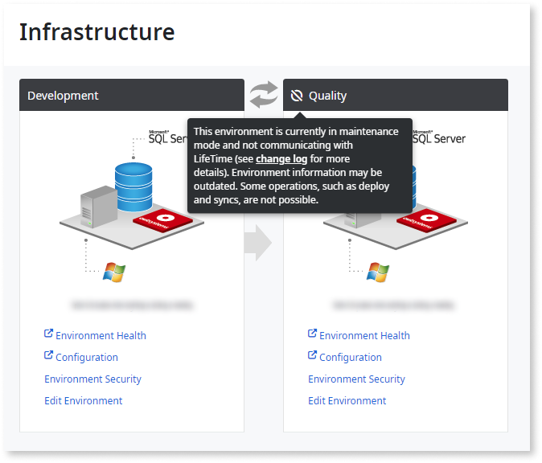
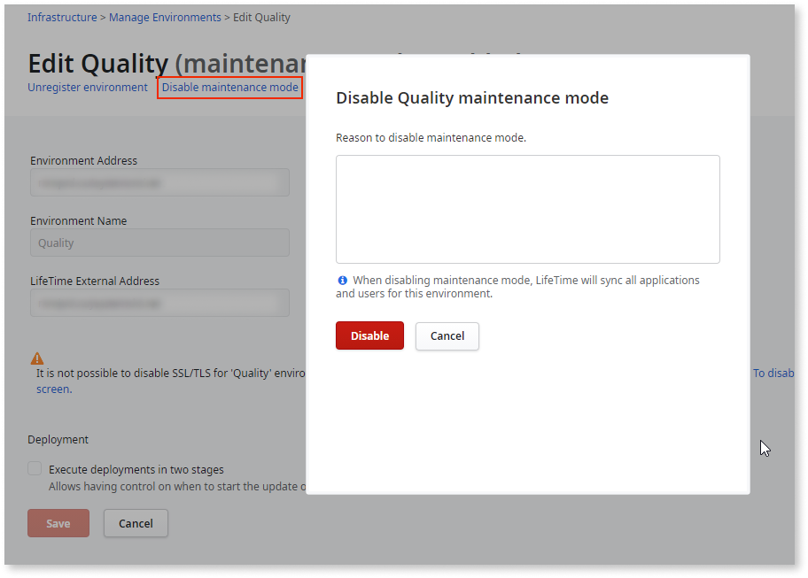

# Environment in maintenance mode

LifeTime continuously synchronizes information with all the registered environments. When there's the need to perform a maintenance operation in an environment, for example a Platform Server upgrade, **maintenance mode** can be enabled. This avoids unnecessary communication attempts from LifeTime to the environment that's under maintenance.

When maintenance mode is enabled in an environment, LifeTime doesn't perform any kind of synchronization with the environment, and some operations are disabled.

LifeTime skips the following actions for an environment in maintenance mode:

* Applications synchronization
* IT users and permission model synchronization
* Environment settings synchronization
* Propagation of new Technical Preview features
* Propagation of the configuration for external authentication providers

Also, the following LifeTime operations are disabled for that environment:

* Tag applications
* Deploy applications from or to the environment
* Operations over deployment plans from or to the environment (for example, edit or retry plan)
* Change application settings
* Test applications (options **Open in Browser** for web apps, and **Test** for mobile apps)
* Navigate to the application details in the Service Center console (options **View Applications Logs**, and **Configure Application**)
* Open an application in Service Studio
* Create new applications for a team
* Enable or disable Technical Preview features
* Create new LifeTime plugins
* Synchronize the environment
* Change the environment security settings
* Edit the environment details (applies only to self-managed environments)

Enabling maintenance mode in an environment affects only the communication between LifeTime and that environment. As long as the environment is online, developers can still reach the environment through Service Studio.

When disabling maintenance mode, LifeTime resumes the communication with the environment, and the environment is fully synchronized.

LifeTime tracks the operations of enabling and disabling the maintenance mode in the [audit logs](monitor-and-troubleshoot/monitor-usage-with-audit-logs.md).

## Enable maintenance mode in an environment

In OutSystems Cloud, your infrastructure is fully managed by OutSystems. When performing a maintenance operation in one of your Cloud environments, OutSystems enables maintenance mode accordingly.

If you have a **self-managed infrastructure**, you can enable maintenance mode in an environment before the execution of a planned maintenance operation. After the operation finishes, you must disable the maintenance mode to get the environment synchronized with LifeTime again.

To enable maintenance mode in an environment, do the following:

1. In the **Infrastructure** tab, click the **Edit Environment** link for the environment you want to enable the maintenance mode.

1. Click the **Enable maintenance mode** link.

1. Fill in the reason to enable maintenance mode and click **Enable**.

Maintenance mode is now enabled, and LifeTime doesn't communicate with the environment. Any on-going deployment or synchronizations in the environment are aborted. This operation and the corresponding reason are registered in the [audit logs](monitor-and-troubleshoot/monitor-usage-with-audit-logs.md).

## Disable maintenance mode in an environment

In OutSystems Cloud, your infrastructure is fully managed by OutSystems. After performing a maintenance operation in one of your Cloud environments, OutSystems disables maintenance mode accordingly.

After you finish a maintenance operation in your **self-managed infrastructure**, disable maintenance mode in the environment:

1. In the **Infrastructure** tab, click the **Edit Environment** link for the environment you want to disable the maintenance mode.

1. Click the **Disable maintenance mode** link.

1. Fill in the reason to disable maintenance mode and click **Disable**.

LifeTime resumes the communication with the environment, and the environment starts synchronizing. This operation and the corresponding reason are registered in the [audit logs](monitor-and-troubleshoot/monitor-usage-with-audit-logs.md).
