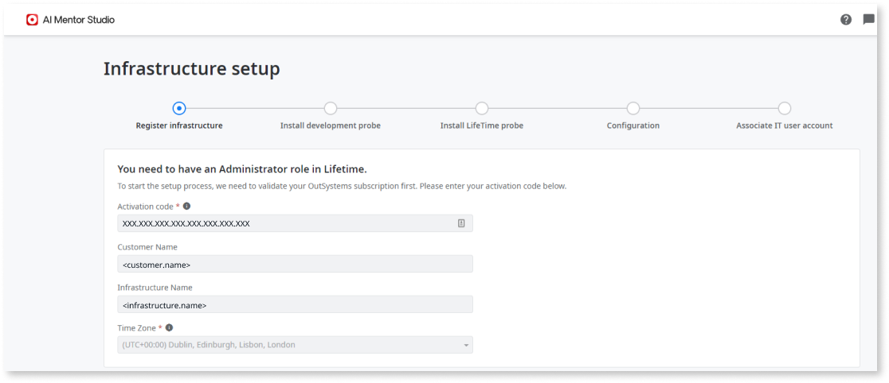
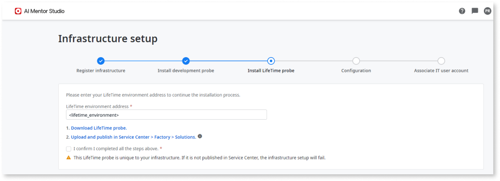
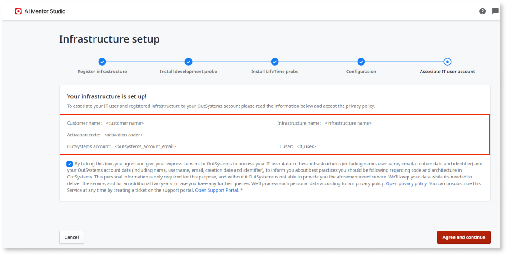

# How to set up AI Mentor Studio

Architecture Dashboard is now AI Mentor Studio.

Learn how to configure AI Mentor Studio so you can start using it.  
This topic shows you how to add an infrastructure and what the prerequisites are, and how to associate an IT user with AI Mentor Studio. 

To change the language of AI Mentor Studio select your user name, then select a language under **Language**.

## Log in for the first time {#first-login}

When you log in to [AI Mentor Studio](https://aimentorstudio.outsystems.com/) for the first time you are shown a welcome screen.

Select one of the options shown in the welcome screen:

[Register and set up my infrastructure](#register)
:   Choose this option if your infrastructure isn't registered in AI Mentor Studio. You must be an Administrator in LifeTime.

[Associate your IT user with AI Mentor Studio](#associate).
:   Choose this option if your infrastructure is already registered in AI Mentor Studio.

## Register and set up your infrastructure in AI Mentor Studio {#register}

### Prerequisites

Before registering and setting up your infrastructure in AI Mentor Studio, make sure that the following requirements are met:

* Your infrastructure is associated with an [OutSystems Edition](https://www.outsystems.com/pricing-and-editions/) that isn't the Free Edition. **You can't use a Personal Environment with AI Mentor Studio**.

* **LifeTime** is deployed in a **dedicated environment**.

* Your infrastructure uses **OutSystems 11**.

* Your development environment uses **Platform Server Release Apr.2019** or later.

* Your LifeTime environment uses **LifeTime Management Console Release Jul.2019** or later.	

* Allow outbound HTTPS communication (port 443) from the  **LifeTime environment** to `https://aimentorstudio.outsystems.com/Probe_API/rest/Synchronization`. Check [AI Mentor Studio network requirements for detailed information](../../setup-maintain/setup/network-requirements.md#ai-mentor-studio).

* You have the **Administrator** role in your infrastructure.

### Register and set up your infrastructure

To set up your infrastructure in AI Mentor Studio, follow these steps:

1. After logging in https://aimentorstudio.outsystems.com/, select **Register and set up my infrastructure** and select **Start**.

1. Enter your **Activation Code**.

    

    

    If the infrastructure is already registered in AI Mentor Studio, a message lets you know and you are asked to **Associate your IT user to a registered infrastructure**.

    

1. Check the information and select **Register**.

    

1. Read the **AI Mentor Studio disclaimer** with the terms and conditions. If you agree select **Accept and continue**.

1. Enter the address of your code analysis environment.

    

1. Follow the procedure shown in AI Mentor Studio to install the Development probe:

    1. Select **Download Development probe** to download the probe.

    1. In the Service Center of the **Development environment** (`https://<development_environment>/ServiceCenter`), go to **Factory**>**Solutions** and install the **Development probe**.

1. After completing the previous steps, select the **I confirm I completed all the steps above.** check box and select **Next**.

1. Enter the address of your LifeTime environment.

    

1. Follow the procedure shown in AI Mentor Studio to install the LifeTime probe:

    

    1. Select **Download LifeTime probe** to download the probe.

    1. In the Service Center of the **LifeTime environment** (`https://<lifetime_environment>/ServiceCenter`), go to **Factory**>**Solutions** and install the **LifeTime probe**.

1. After completing the previous steps, select the **I confirm I completed all the steps above.** check box and select **Next**.

1. After you are redirected to LifeTime, log in with your IT user.

1. Configure the **Code analysis** probe by selecting the development environment as the **Target environment**. 

    

    

    To change the target environment of a code analysis probe, contact [technical support](https://success.outsystems.com/Support/Enterprise_Customers/OutSystems_Support/01_Contact_OutSystems_technical_support) to delete existing data from AI Mentor Studio. Do this before installing probes in a new environment or deleting probes from an existing environment to avoid data inconsistencies. Once existing data is deleted from AI Mentor Studio, follow the setup procedure in this article to configure a new target environment.
    
    

1. Optional: If you want the AI Mentor Studio plugin to use a forward proxy while connecting to the AI Mentor Studio SaaS, in the **Proxy configuration** section, select **show request information**, and enter the proxy URL and the credentials.

1. Select **Save and activate probes**.

1. After you are redirected to AI Mentor Studio, associate your IT user with AI Mentor Studio:

    

    1. Check the **Installation details** and read the **privacy policy** carefully.

    1. If you agree with the privacy policy, select the check box and then select **Agree and continue**.

After completing these steps you are able to see your infrastructure listed but it may take up to 12 hours for your apps to appear in AI Mentor Studio.

## Associate your IT user with AI Mentor Studio {#associate}

1. After logging in https://aimentorstudio.outsystems.com/, select **Associate my IT user** and select **Start**.

1. Go to **LifeTime** (`https://<lifetime_environment>/lifetime`) and **Login** using your IT user credentials.

    `<lifetime_environment>`is the address of the LifeTime Environment for the Infrastructure that you are associating with your account.

1. Select **Plugins** \> **AI Mentor Studio**.

    

    

    If your LifeTime doesn't have a **Plugins** menu, select **More** \> **AI Mentor Studio**.

    

1. Select **Go to AI Mentor Studio**.

    

1. After you are redirected to AI Mentor Studio, associate your IT user with AI Mentor Studio:

    1. Check the **Installation details** and read the **privacy policy** carefully.

    1. If you agree with the privacy policy, select the check box and then select **Agree and continue**.
