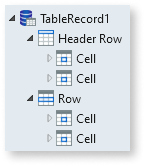

Widget containing the cells that are part of the header row of a [Table Records Widget](<Class.Table Records Widget.final.md>).

When you add a Table Records Widget to a screen, the table gets a Header Row Widget automatically. To hide the header row of the table, set the **Show Header** property of the Table Records Widget to `No`.

Each time you add or remove a new attribute to the Table Records Widget, Service Studio adds or removes a table [Cell](<Class.Cell Widget.final.md>) to/from both the Header Row and the regular table [Rows](<Class.Row Widget.final.md>) used to display data.

For example, in a Table Records Widget where you added two attributes, this is the result in the widget tree, with one Header Row and one Row (at design time), each containing two Cells:

**Tip:** If you want to have a fixed table header and keep a scrollable list of table rows for the data, check [How to scroll records in a table with a fixed header](https://success.outsystems.com/Documentation/How-to_Guides/Front-End/How_to_scroll_records_in_a_table_with_a_fixed_header).

