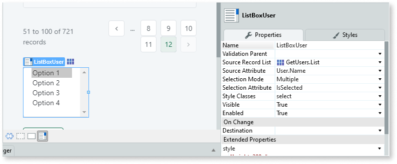
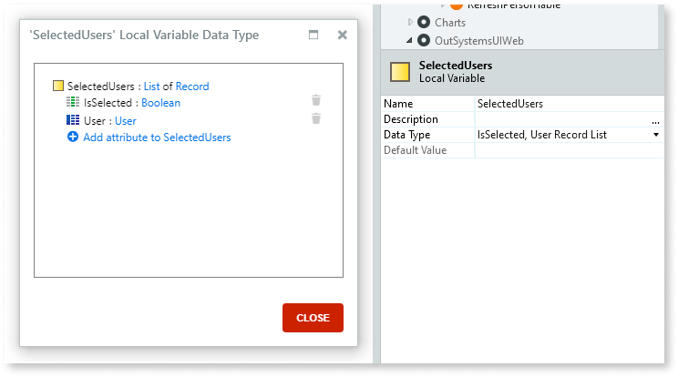
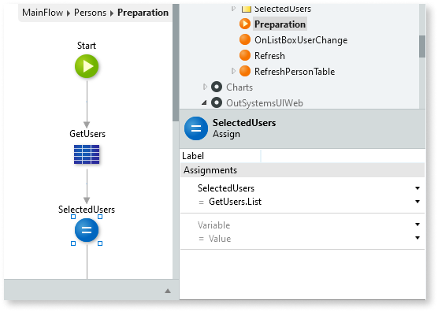

Allows the user to select one or more values from a list of possible values.

Consider the following alternatives if your users need to select only **one value** from a list:

* [Combo Box Widget](<Class.Combo Box Widget.final.md>)
* [Dropdown](../../../develop/ui/patterns/web/controls/dropdown.md) UI Pattern

The **Source Record List** property defines the source of the list of possible values. You can get the list of values from an Aggregate or SQL element, or you can build your own list of Records.

The text for each value displayed in the List Box comes from the attribute set in the **Source Attribute** property.

The List Box widget allows users to select multiple values by default. You can configure the List Box widget to only allow users select one value from the list. Configure this behavior by setting the **Selection Mode** property to `Multiple` or `Single`, respectively.

Users can select multiple values from the list by pressing the `Ctrl` key while simultaneously selecting the values.

## Obtaining the values that the user selected

The Record definition must include a Boolean attribute to hold the user selection. One way of achieving this when you're using an Aggregate as the record source list is to an extra calculated attribute to the Aggregate with Boolean data type.

For example, the following Aggregate from a screen Preparation contains a calculated attribute named **IsSelected**. The List Box widget uses this attribute to store the information about the selected records. In the Aggregate definition, the value of this calculated attribute is `False`, meaning that every row in the result list has this value, and that the List Box selection is empty by default.

After defining the source Aggregate with an additional calculated attribute for keeping the selection status of each Record, set the properties of the List Box widget.

In the example above, the List Box displays the names of users as selectable values. It uses the IsSelected attribute to store the information about the current selection. At runtime, each selected value from the list has the IsSelected attribute set to `True`.

When there's a Submit operation, you can access the list of Records through the **List** runtime property of the widget. This property includes updated values in the IsSelected attribute according to the items the user selected.

In the following example, the user selects the second value from a list (item `[1]` from the **List** runtime property has its IsSelected attribute set to `True`):

## Keeping the selection when refreshing the widget

You must take care when using Ajax refresh operations to refresh the List Box widget. Doing a refresh clears the currently selected values.

Executing any action that performs a Submit operation (for example, clicking on a button or link with the *Method* property set to `Submit`) also clears the current selection of the List Box widget.

To maintain the selection when there's an Ajax refresh, you can follow an approach similar to the following:

1. Instead of using Aggregate results directly, define a local variable to use as the source list. For example, if your original Aggregate had the User entity as a source, define a local variable with data type "IsSelected, User Record List", where IsSelected is a Boolean attribute.

    

    This allows each record to hold both the attributes of a User record and also the selection state.

1. In the Preparation, set this local variable to the **List** runtime property of the Aggregate.

    

1. In the List Box widget properties, set the **Source Record List** property to your local variable.

1. Create a new action that handles the **On Change** event of the List Box. To maintain the selection information, in the action flow, assign the value of the **List** runtime property of the List Box to the local variable, so that you keep the selection information.

    

## Combining with other widgets and UI Patterns

If you're allowing users to select multiple values in a List Box widget, consider using the [Dropdown Select](../../../develop/ui/patterns/web/controls/dropdownselect.md) UI Pattern together with the List Box. The Dropdown Select UI Pattern makes it easier for an end user to check the list items he already selected.
