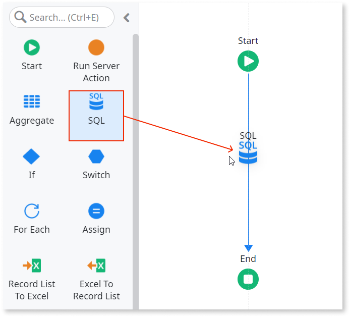
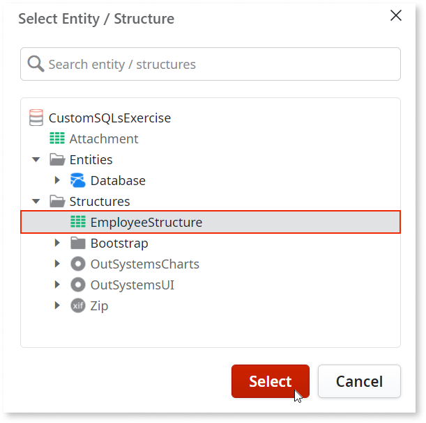

# Query Parameter

The SQL Tool doesn't have direct access to the outside scope. Query parameters allow you to access data from the outer scope. In order to have access to data coming from the outer scope, you need to define the input parameters and their data types.

## How to use

In this example, there is a data model with an Entity `Employee`. 

To create a query that uses a search input as query parameter, follow these steps:

1. From the toolbox, drag an **SQL** widget and drop it in the action flow between the **Start** and **End** nodes.

    

1. Double-click the newly created **SQL** widget to open the SQL Editor.

1. Right-click the **Parameters** folder, and select **Add Query Parameter**.

    

1. Set the **Name** of the Query Parameter to `QuerySearch`, and make sure its **Data
Type** is set to `Text`.

    

1. In the **SQL** tab, enter the following query:

    ```sql
    SELECT
    {Employee}.[FirstName] + ' ' + {Employee}.[LastName],
    {Employee}.[Email],
    {Employee}.[Phone],
    {Employee}.[Salary]
    FROM
    {Employee}
    WHERE
    {Employee}.[FirstName] LIKE '%' + @QuerySearch + '%'
    OR
    {Employee}.[LastName] LIKE '%' + @QuerySearch + '%'
    ```

1. Double-click **Output Entities/Structures** to select the output structure of
the query. In this example, there is already a structure named EmployeeStructure with the attributes Name, Email, Phone and Salary. Select it, and click **Select**.

    

1. Click **Test** to test the query.

1. In the **Test Inputs** tab, set some value for the QuerySearch parameter, then click **Test** again to make sure the filter is working.


## Properties

<table markdown="1">
<thead>
<tr>
<th>Name</th>
<th>Description</th>
<th>Mandatory</th>
<th>Default value</th>
<th>Observations</th>
</tr>
</thead>
<tbody>
<tr>
<td title="Name">Name</td>
<td>Identifies an element in the scope where it is defined, like a screen, action, or module.</td>
<td>Yes</td>
<td></td>
<td></td>
</tr>
<tr>
<td title="Description">Description</td>
<td>Text that documents the element.</td>
<td></td>
<td></td>
<td>Useful for documentation purpose.<br/>The maximum size of this property is 2000 characters.</td>
</tr>
<tr>
<td title="Data Type">Data Type</td>
<td>The parameter data type.</td>
<td>Yes</td>
<td>Text</td>
<td>The parameter data type must be a basic data type or an Entity Identifier.</td>
</tr>
<tr>
<td title="Expand Inline">Expand Inline</td>
<td>Set to Yes to use the query parameter to implement part or all of the SQL query at runtime.</td>
<td>Yes</td>
<td>No</td>
<td></td>
</tr>
</tbody>
</table>

