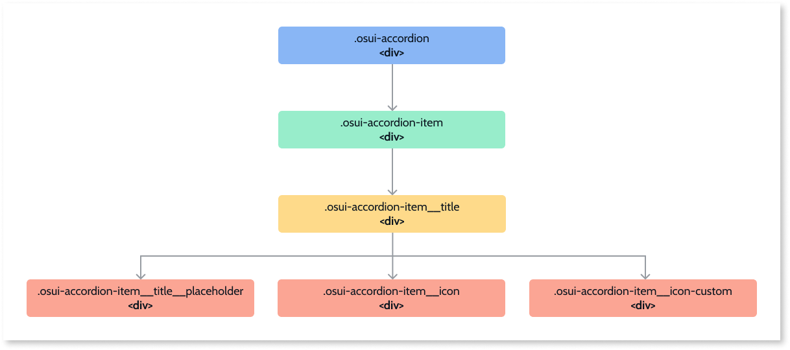
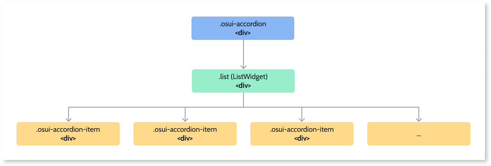

# Accordion Reference

Applies only to Mobile Apps and Reactive Web Apps

## Events - Accordion

|**Event** |**Description**| 
|---|---|
| AccordionCollapseAll: Optional |<ul><li>Function that collapses all the expanded items of a given accordion.</li><li>WidgetId (text): The accordion's ID to perform the action.</li></ul>|
| AccordionExpandAll |<ul><li>Function to expand all the collapsed items of a given accordion.</li><li>WidgetId (text): The accordion's ID to perform the action.</li></ul>|

## Events - Accordion Item

|**Event** |**Description**| 
|---|---|
| AccordionCollapseAll: Optional |<ul><li>Closes an AccordionItem with a given identifier.</li><li>WidgetId (text): Identifier of the AccordionItem block.</li></ul>|
| AccordionExpandAll |<ul><li>Opens an AccordionItem with a given identifier.</li><li>WidgetId (text): Identifier of the AccordionItem block.</li></ul>|

## Structure

### Accordion base structure

### Accordion and List widget

## API - Accordion

If you are an advanced user, you might want to use the Accordion API (OutSystems.OSUI.Patterns.AccordionAPI) for more complex use cases.

### Methods

|**Function** |**Description**|**Parameters**|
|---|---|---|
|ChangeProperty|Changes the property of the Accordion|<ul><li>accordionId: string</li><li>propertyName: string</li><li>propertyValue: any</li></ul>|
|CollapseAllItems|Collapses all the expanded items of a given accordion|<li>accordionId: string</li>|
|Create|Creates the new Accordion instance and adds it to the AccordionMap.|<ul><li>accordionId: string</li><li>configs: string</li><li>provider: string</li></ul>|
|Dispose|Destroys the instance of the given Accordion.|<li>accordionId: string</li>|
|ExpandAllItems|Expands all the collapsed items in a given accordion.|<li>accordionId: string</li>|
|GetAllAccordions|Returns the Map with all the Accordion instances at the page.|<li>Returns array of Ids</li>|
|GetAccordionById|Gets the Carousel instance ID.|<li>accordionId: string</li>|
|Initialize|Initializes the pattern instance.|<li>accordionId: string</li>|

## API - Accordion Item

If you are an advanced user, you might want to use the Accordion Item API (OutSystems.OSUI.Patterns.AccordionItemAPI) for more advanced use cases.

### Methods

|**Function** |**Description**|**Parameters**|
|---|---|---|
|ChangeProperty|Changes the property of the Accordion Item.|<ul><li>accordionItemId: string</li><li>propertyName: string</li><li>propertyValue: any</li></ul>|
|Collapse|Closes the Accordion Item|<li>accordionItemId: string</li>|
|Create|Creates the new Accordion Item  instance and adds it to the AccordionItemMap.|<ul><li>accordionItemId: string</li><li>configs: string</li><li>provider: string</li></ul>|
|Dispose|Destroys the instance of the given AccordionItem.|<li>accordionItemId: string</li>|
|Expand|Opens the AccordionItem|<li>accordionItemId: string</li>|
|GetAllAccordionItems|Returns the Map with all the Accordion Item instances at the page.|<li>Returns array of Ids</li>|
|GetAccordionItemById|Gets the AccordionItem instance ID.|<li>accordionItemId: string</li>|
|RegisterCallback|Registers a callback on this pattern.|<ul><li>accordionItemId: string</li><li>callback: OSUIFramework.Callbacks.Generic</li></ul>|
