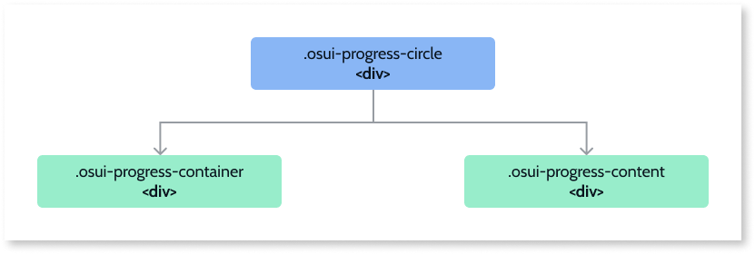

# Progress Circle Reference
 

Applies only to Mobile Apps and Reactive Web Apps

## Structure

### Modifiers

|Event Name|Description|Mandatory| 
|---|---|---|  
|ProgressColor|--progress-color|.osui-progress-circle|  
|TrailColor|--trail-color|.osui-progress-circle|  
|Thickness|--thickness|.osui-progress-circle|  
|Size|--circle-size (width and height)|.osui-progress-circle|  

## API

If you are an advanced user, you might want to use our Progress Circle API (OutSystems.OSUI.Patterns.ProgressCircleAPI) for more advanced use cases. 

### Methods

|Function|Description|Parameters| 
|---|---|---|  
|ChangeProperty|Changes the property of a given Progress Circle.|<ul><li>progressId: string</li><li>propertyName: string</li><li>propertyValue: any</li></ul>|  
|Create|Create the new Progress Circle instance and add it to the progressMap.|<ul><li>progressId: string</li>configs: string<li></li></ul>|  
|Destroy|Destroys the instance of the given Progress Circle.|<ul><li>progressId: string</li></ul>|  
|GetAllProgressItemsMap|Return the Map with all the Progress Circle instances on the page.|<ul><li>Returns array of Ids</li></ul>|  
|GetProgressById|Gets the instance of the Progress Circle by a given Id.|<ul><li>progressId: string</li></ul>|  
|Initialize|Initializes the pattern instance.|<ul><li>progressId: string</li></ul>|  
 

