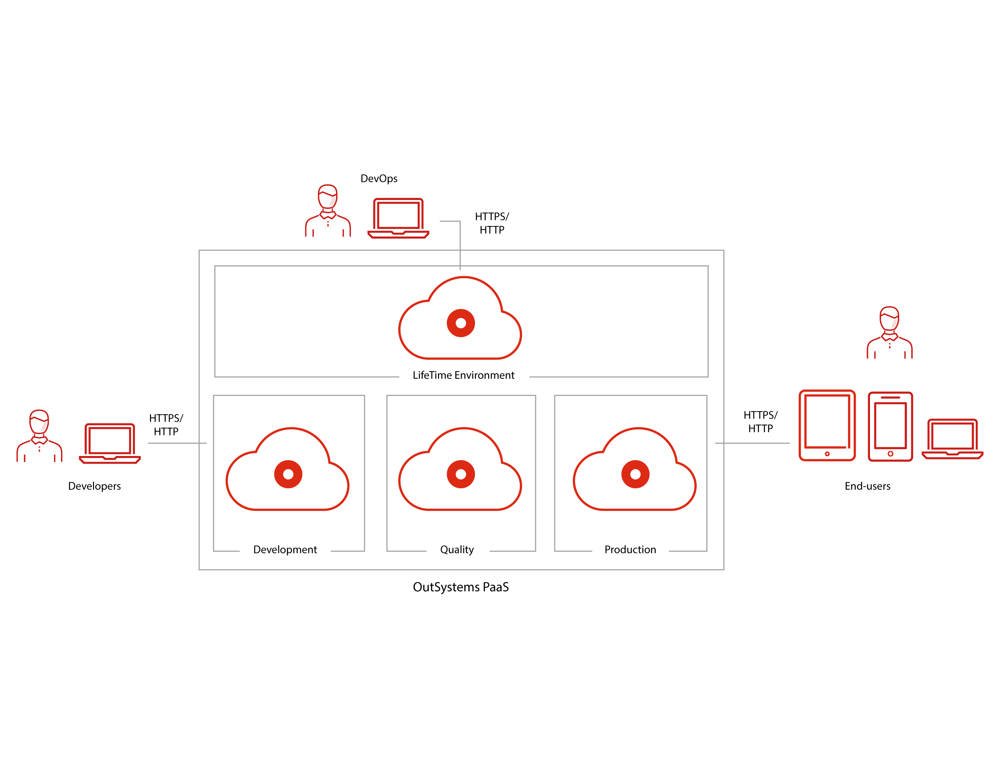
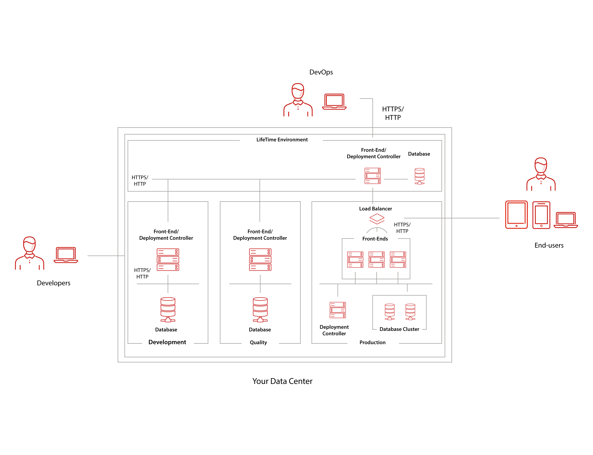

# Possible setups for an OutSystems infrastructure

This article applies to: **OutSystems 11**&#8195;&#8195;Other versions available: [10](https://success.outsystems.com/Documentation/10/Setting_Up_OutSystems/Possible_setups_for_an_OutSystems_infrastructure)

OutSystems allows delivering enterprise web and mobile applications that run in the cloud or on-premises environments. Since it covers the full application lifecycle, from development to deployment, a typical OutSystems installation is comprised of an infrastructure with four environments:

* **Development Environment:** In development you create accounts for all developers and development managers of the Development Team.

* **Quality Environment:** In quality environment is where testers and business users experiment the production candidate applications or the application versions resulting from (agile) sprints. There are usually few scalability and redundancy requirements for this environment.

* **Production Environment:** In production, full control is given to the Operations team but is advisable to setup read-only access accounts for development/maintenance teams to have access to analytics information on performance and application errors.

* **LifeTime Environment:** LifeTime is the console for managing the infrastructure, environments, applications, IT users, and security.

Even though this is the typical OutSystems infrastructure, you can always adjust the infrastructure to add and remove environments, since the platform is made to scale with your own needs.

## Cloud infrastructure

Since OutSystems [runs on the cloud](cloud-architecture.md), it's possible to set up your infrastructure with a mouse-click. You only have to install Service Studio and Integration Studio development tools to start developing and deploying your applications. Learn more at [www.outsystems.com](https://www.outsystems.com).

## On-premises infrastructure

If you need to retain the control of your servers, simply install OutSystems in your own datacenter.

The scenario depicts an infrastructure where you manage the environments: Development, Quality Assurance, Production, and LifeTime. In this case you’ll have to install the Platform Server in each server of your infrastructure (front-ends and deployment controllers), and Service Center for each environment, to monitor them. You’ll also need to install LifeTime, the console to manage your infrastructure. Given its requirements, LifeTime must run in a **dedicated** environment. **Installing LifeTime in an existing environment is not supported from version OutSystems 11 onwards.**
