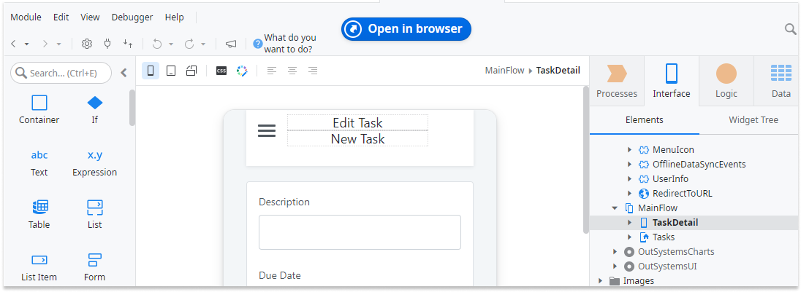
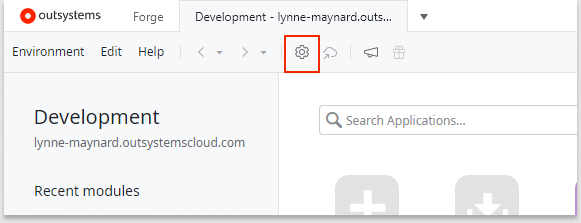
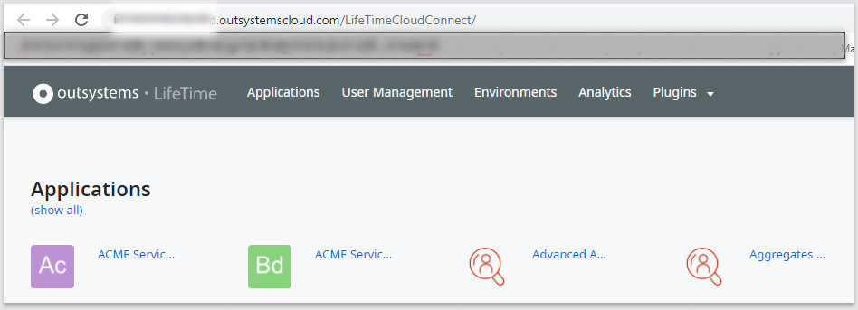

# Setting Up OutSystems

This article applies to: **OutSystems 11**&#8195;&#8195;Other versions available: [10](https://success.outsystems.com/Documentation/10/Setting_Up_OutSystems)&#8195;[9.1](https://success.outsystems.com/Support/Archive/9.1/01_Install_and_set_up_OutSystems_Platform)&#8195;[9.0](https://success.outsystems.com/Support/Archive/9.0/01_Install_and_set_up_OutSystems_Platform)

This article provides an overview of OutSystems components and describes how to set up an OutSystems cloud environment.

## OutSystems Components
OutSystems components allow you to develop, manage, and administer your applications. The following graphic shows the components at a high level. 

OutSystems components provide the following functionality:

* **Service Studio:** -- The visual development tool where you create, change, and deploy your applications. You install Service Studio on your local Winfows or Mac system. Go to https://www.outsystems.com/downloads/ to download Service Studio. 

    

* **Service Center:** -- A centralized console for managing the infrastructure, environments, applications, IT users, and security. After you install Service Studio, click the gear icon or go to **Environment** > **Environment Management** to access Service Studio. 

    The Service Center URL has the format:
    
    https://*environment-name*.outsystemscloud.com/ServiceCenter.
 
  

* **LifeTime:** The centralized console for managing the infrastructure, environments, applications, IT users, and security. After you install Service Studio, go to Service Center, where you can access a link to LifeTime. From Servcei Center, in the upper right corner, click **Manage all environments in LifeTime**.

    

* **Integration Studio:** The development tool to create connectors to integrate OutSystems applications with other enterprise systems. You install this tool on a developer's system. Only Windows is supported at this time.

### OutSystems Platform Server
The Platform Server resides in the cloud and takes care of the steps to generate, build, package and deploy your applications. You don't need to install or manage your Platform Server environment; OutSystems manages this part of the environment for you.

### Typical infrastructure

OutSystems covers the full application lifecycle, from development to deployment. OutSystems free version includes these environments:

* **Development Environment:** The environment where applications are initially developed and tested.

* **Production Environment:** The environment that hosts the application version end users are interacting with. Usually, this environment is only accessible by the operations team.

* **Management Environment:** The environment that hosts LifeTime application, which is the infrastructure management console. Given its requirements, LifeTime application must run in a **dedicated** environment. 

## Limitations

The Platform Server in a cloud environment is set up for you. You'll receive an email with access details, such as address and usernames, when you sign up. When managing a single environment or infrastructure on the OutSystems cloud, note the following   limitations:

* Currently, our cloud provider (Amazon Web Services) doesn't support customizing the time zone for SQL Server. Conversions need to be done programmatically from UTC to the desired time zone.

* Custom database objects such as stored procedures aren't supported. You can either implement the same logic using "Advanced Queries" (standard SQL) or through Extensions (by implementing your own C# code).

* The Multiple Database Catalogs and Schema feature isn't available. This means that all applications store their data in the same database Catalog/Schema.

## Installation prerequisites

Before installing any component of OutSystems, make sure your hardware and software comply with the minimum requirements. For this, be sure to check:

* [System requirements](../getting-started/system-requirements.md)

* [Network requirements](../getting-started/network-requirements.md)

# Sign up for a free environment

To sign up for a trail version of OutSystems:

1. Go to https://outsystems.com/home/GetStarted_FreeEdition.aspx. 
2. Type your information in the required fields or sign in with your LinkedIn or Google account. Follow the instructions and click Continue.
3. On the Welcome screen, click **Download Service Studio**. 
4. Click the **.exe** file to install Service Studio.
5. Follow the online prompts to complete the setup of your environment. 
6. Optionally, on the Welcome screen, invite other developers to access the trial environment.
7. Optionally, from the Welcome screen, play the two-minute video overview to help you get started.

### 6. Install and configure the development tools

OutSystems is now ready for you to start developing. The only thing missing is to [install the development tools](http://www.outsystems.com/home/downloads/) on your developers' desktops. Be sure to install a version of the development tools that is compatible with the version of the Platform Server installed in your environments.

## More Information

If you are having trouble installing or setting up OutSystems, check the [OutSystems Community](http://www.outsystems.com/forums/) for help, or reach out to the [OutSystems technical support](https://success.outsystems.com/Support/Enterprise_Customers/OutSystems_Support/01_Contact_OutSystems_technical_support).
